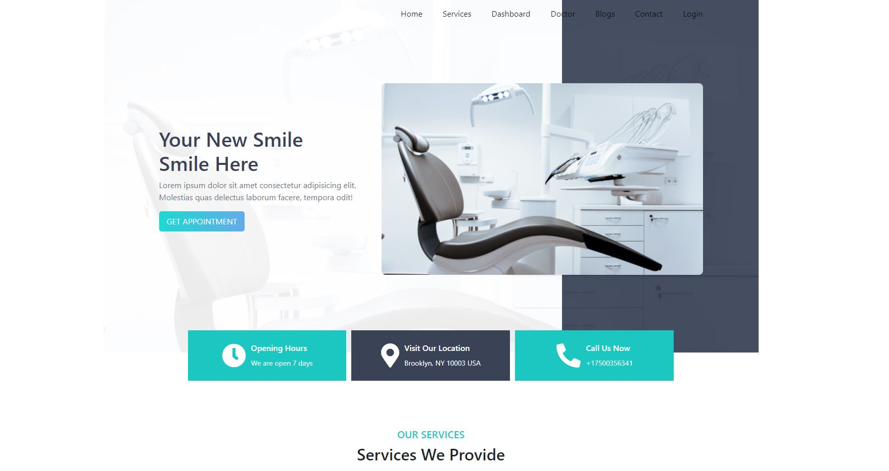

# Doctor Portals

### [visit website](https://doctor-portals.netlify.app/) | [live API server](https://vast-gorge-08839.herokuapp.com/)

### Features

1. Authentication system with google.
2. An authentication person can geth service.
3. Different Admin Panel and User Panel

### Front-End Technology

+ React.js
+ JavaScript
+ CSS3
+ Bootstrap

### Back-End technology

+ Node.js
+ MongoDB(database)
+ Express.js
+ Heroku

### [view back-end code](https://github.com/rjmahfuztech/doctor-portals-server)
